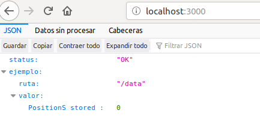
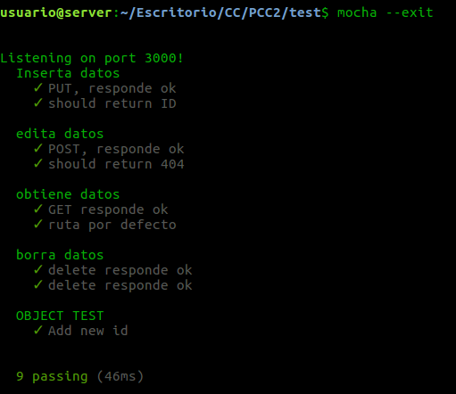
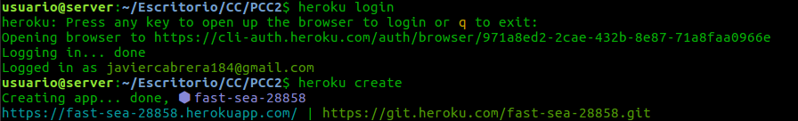
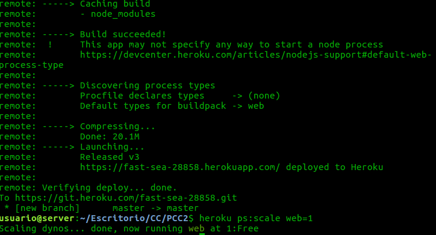
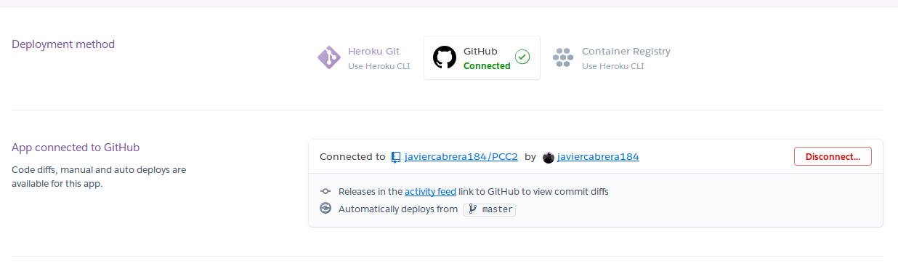
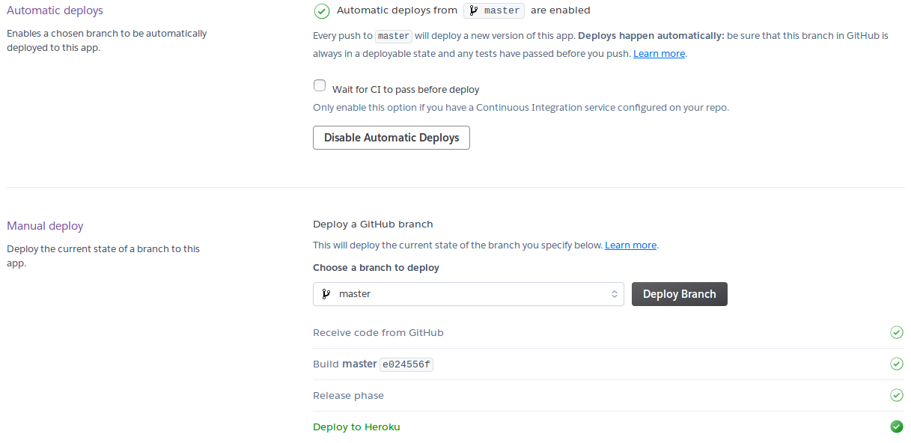
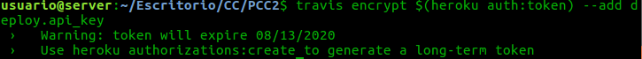
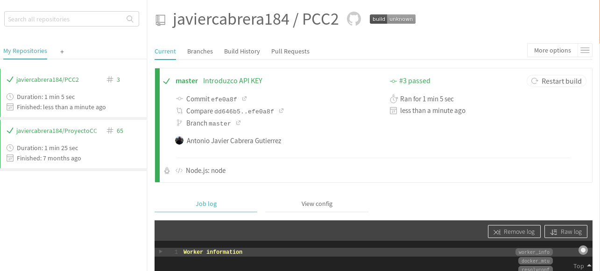

# Hito 2

En este hito se ha desarrollado una API REST como microservicio de nuestra aplicación.
También se ha realizado integración continua con Travis y se ha desplegado con Heroku.

## Microservicio

Nuestro microservicio consta de una API REST la cual tiene unos verbos HTTP para poder usarla. Este microservicio se ha desarrollado en NodeJS usando el framework de express.

Su función es la de insertar, actualizar, obtener y eliminar datos de posiciones de jugadores en un terreno de juego. Estas posiciones están determinadas por una coordenada x y una coordenada y.

La clase subyacente a nuestra aplicación consta de campos que nos serán útiles para los datos que almacenemos. La clase consta de los siguientes datos:

* X: coordenada x.
* Y: coordenada y.
* Time: marca de tiempo.
* Match: identificador del partido.
* Player: identificador del jugador.
* ID: identificador del dato, compuesto por la concatenación de encuentro, jugador y marca de tiempo separados por comas.

Para su desarrollo se ha seguido la estructura vista en los apuntes de la asignatura.

## Rutas

En este apartado se explican las rutas usadas y su función:

* GET /: ruta por defecto.
* GET /data: obtención de todos los datos.
* POST /data/match/pla/x/y/time/: edita las posiciones x e y.
* PUT /data/match/pla/x/y/time/: inserta un nuevo dato.
* DELETE /data/match/pla/x/y/time/: borra el dato indicado.

Todas estas operaciones devuelven un estado 202 si se ejecutan de forma correcta y un estado de 404 si la operación es fallida.

Esta es la salida de la ruta por defecto:



## Test

También se ha desarrollado unos tests para el método de la clase que crea el ID y los verbos HTTP de la API REST.

Para la ejecución de estos tests se debe de ejecutar el siguiente comando:

```
mocha --exit
```
En el directorio donde esta nuestro archivo test.js. Esta es la salida:



En los tests también se ha seguido la estructura de los apuntes.

## Configuracion y dependencias

En el package.json debemos de indicar los comandos de test y de inicio de nuestra aplicación así como las dependencias. Normalmente esto se hace cuando se ejecuta npm init al inicio de nuestro proyecto y las dependencias se añaden cuando hacemos npm install. Ahora describiremos los frameworks utilizados y su uso:

* Express: Usado para construir la API.
* Supertest: Usado para la realización de los test.
* Should y assert: Usado para aserciones.


## Despliegue:

Para hacer el despliegue se ha usado el PaaS Heroku. El motivo de su uso es porque es gratuito, fácil de configurar y se integra fácilmente con Travis.

Para desplegar nuestra aplicación en Heroku primero debemos de instalarlo y registrarnos. Esto seria la salida si se hiciera desde la línea de comandos:



También se tiene que indicar el numero de dynos (máquinas virtuales) que nos tiene que desplegar y que tipo, en este caso web.



Esto se puede indicar en un archivo Procfile que debemos de incluir en nuestro repositorio. Para que cuando Heroku cargue nuestra aplicación desde nuestro repositorio al hacer un push esto se haga automáticamente.( Esto se explica mas adelante).

El contenido del Procfile es el siguiente:

```
web: node app.js

```
Esto indica el tipo de dyno (web) y el comando para ejecutar la aplicación.


Para que nos despliegue desde github cada vez que hagamos un push debemos de conectar heroku a github y le indicamos que haga los despliegues automaticos.





## Integración continua

Para hacer la IC hemos usado Travis. Una vez nos registramos con Travis lo conectamos con github, normalmente si se registra uno con github esto es automático. Activamos el repositorio que queremos usar travis e incluimos en nuestro repositorio un fichero llamado .travis.yml. Este fichero tendrá las instrucciones que seguirá heroku para el despliegue y los test que comprobarán que la aplicación no tiene ningún fallo.

El fichero .travis.yml es el siguiente:

```
branches:
  only:
  - master
language: node_js
sudo: false
node_js:
- node
install:
- npm install mocha
- npm install supertest
- npm install express
- npm install assert
- npm install should
deploy:
  provider: heroku
  api_key:
    secure: sZXhv/....JhciTlE=
  strategy: git
  app: fast-sea-28858
  on:
    repo: javiercabrera184/PCC2

```
Con esto le estamos diciendo la rama y el lenguaje a utilizar, las dependencias que usa nuestra aplicación y el despliegue en heroku.


Para generar la api key debemos de ejecutar el siguiente comando para que nos lo genere.


Una vez tenemos esto y hacemos un commit y un push los test deben de ser ejecutados y Heroku una vez los test pasen, ejecutara la aplicacion. Para ello debemos de marcar la opción de *Wait for CI to pass before deploy*.

Esto nos debería de salir cuando heroku parara los test.


Para que nuestra aplicación funcion correctamente en Heroku se debe de añadir la siguiente línea en nuestra app.

```
var port = process.env.PORT || 3000;

```

Esto hace que Heroku seleccion el puerto que le convenga y no solo el puerto 3000.
