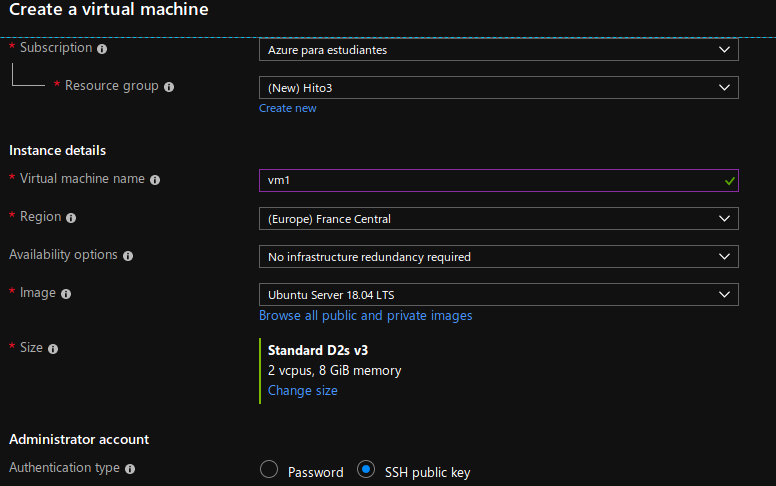
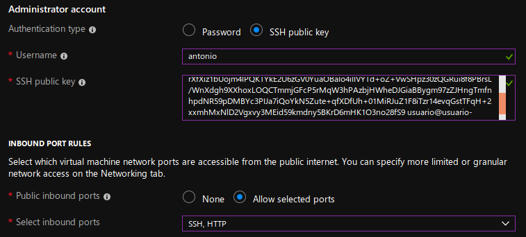
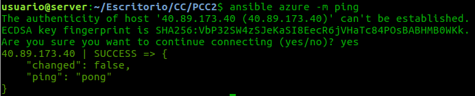
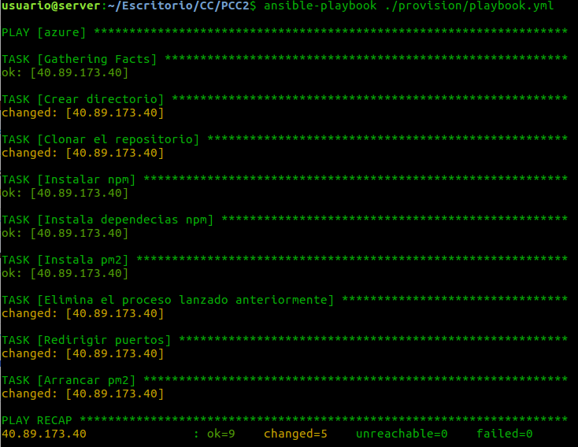
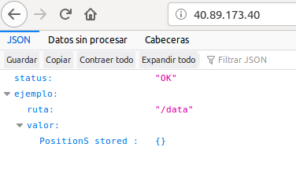

# Hito 3

En este hito se va a describir la infraestructura en la que se va a desplegar nuestra aplicación así como la receta de provisionamiento.

## Máquina virtual

En este apartado se ha levantado una máquina virtual para en esta desplegar nuestra aplicación posteriormente.

El Sistema Operativo elegido es Ubuntu Server 18.04. Esta elección se debe a que después de leer [este artículo](https://thishosting.rocks/debian-vs-ubuntu/) y [este otro](https://thishosting.rocks/centos-vs-ubuntu-server/) me he decidido por decantarme por esta distribución.

Entre las razones que me parecen destacables se encuentran con que es más sencillo de usar, mucha más documentación y actualizaciones más frecuentes, además de mayor soporte.

La versión Server además incorpora NodeJS instalado ya previamente por lo que no tenemos que volver a instalarlo. La versión 18.04 es una versión LTS por lo que tenemos un soporte de 5 años.

Una vez expuestas estas razones vamos a proceder a levantar la máquina virtual. Las opciones de configuración se encuentran en las siguientes imágenes.




* La suscripción y el grupo de recursos en el que se encuentra la máquina virtual.
* El nombre de la mv.
* La región donde va a estar alojada, se ha elegido esta por proximidad.
* La imagen, anteriormente justificada.
* EL disco, se ha cambiado el tamaño por uno de tipo A0, con mucho menor tamaño pero mucho más barato.
* La forma de acceso, por SSH, así que debemos de copiar la clave en el campo de abajo.
* Habilitamos el puerto HTTP y el SSH, el primero para nuestra aplicación y el segundo para el acceso de Ansible.

Importante poner la IP publica siempre la misma para que entre apagado y un encendido la mantenga.

## Ansible

Ansible se ha utilizado para provisionamiento. La razón de usar esta herramienta y no otras es que no hay que instalar ningún agente ni servidor extra. Solo hace falta instalar ansible en local.

Una vez instalado debemos de editar el archivo ansible_hosts que se ubica en el directorio /etc/ansible/hosts. Este fichero debemos de editarlo con lo siguiente:

```
[azure]
40.89.173.40 ansible_user=antonio

```
Con esto le estamos indicando que nuestra IP se encuentra en el grupo azure y tiene un usuario llamado antonio. Ahora ejecutando el siguiente comando podemos hacer ping a nuestra maquina:



Ahora hacemos el provisionamiento para desplegar nuestra aplicación.

El fichero de provisión es el siguiente:
```
---
- hosts: azure
  user: antonio
  vars:
    project_path: /home/antonio/proyecto
  tasks:
    - name: Crear directorio
      file:
        dest={{ project_path }}
        mode=0755
        recurse=yes
        state=directory
    - name: Clonar el repositorio
      git:
        repo: https://github.com/javiercabrera184/PCC2.git
        dest: "{{ project_path }}"
        force: yes
    - name: Instalar npm
      become: true
      become_method: sudo
      apt:
        pkg=npm state=present
    - name: Instala dependecias npm
      npm:
        path={{ project_path }}
    - name: Instala pm2
      become: true
      become_method: sudo
      npm:
        name: pm2
        global: yes
    - name: Elimina el proceso lanzado anteriormente
      command: pm2 delete PR
      ignore_errors: yes
    - name: Redirigir puertos
      become: true
      become_method: sudo
      command: iptables -t nat -I PREROUTING -p tcp --dport 80 -j REDIRECT --to-ports 3000
    - name: Arrancar pm2
      command: pm2 start {{ project_path }}/app.js --name PR

```
Los pasos son los siguientes:

* Crea el directorio donde se va a crear el proyecto.
* Clona el repositorio, indicar el force yes para que si ya esta clonado lo vuelva a clonar.
* Instala npm.
* Instala pm2: esto hace que el proceso en node se ejecute en segundo plano.
* Matamos la aplicación si estaba previamente corriendo.
* Redirigimos el puerto 3000 al 80 para que sea accesible simplemente poniendo la IP de la máquina virtual en el navegador.
* Arrancamos la aplicación con pm2.

Los datos que aparecen al principio del playbook son los hosts que indica el grupo de hosts del inventario de Ansible que vamos a provisionar. El usuario que accede a la maquina virtual y si become para la ejecución de comandos en modo super usuario.

Con el siguiente comando ejecutamos el playbook:

```
ansible-playbook <nombre>
```
Esta es la salida:


Si accedemos a la IP de la mv podemos ver que esta correcto:

