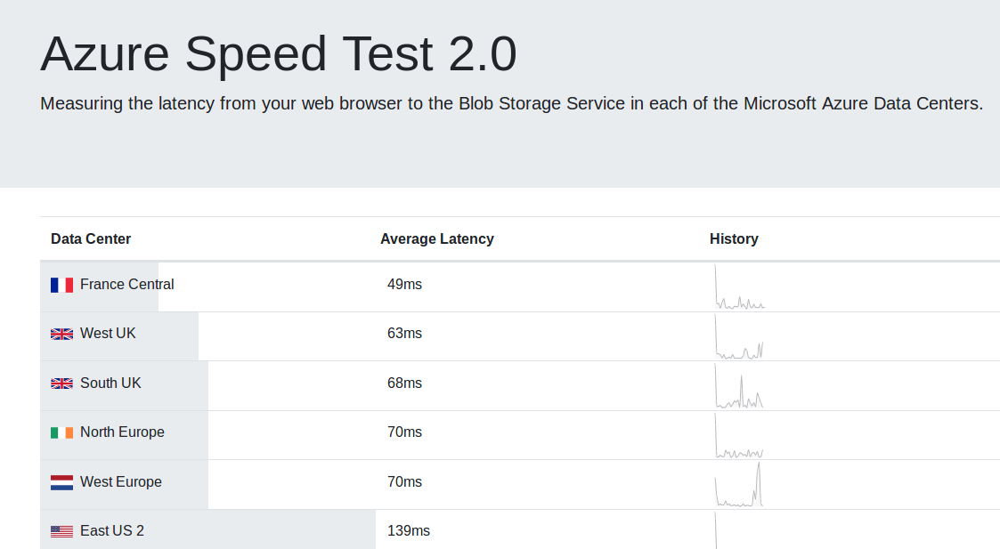
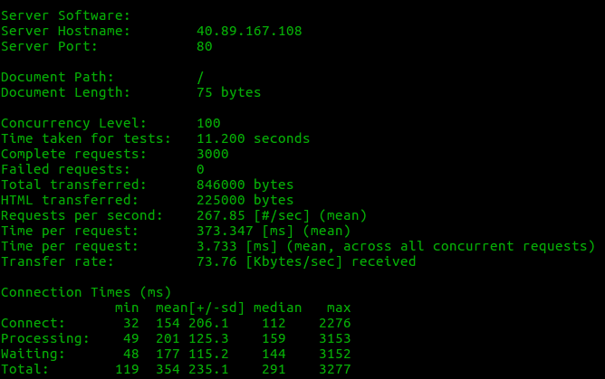
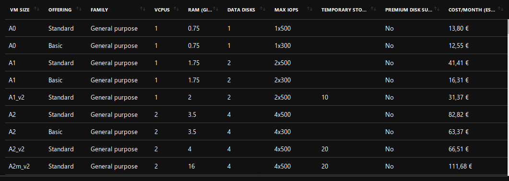

# Hito 4

Se va a realizar el provisionamiento usando la herramienta de Azure CLI y además se va a añadir MongoDB a la aplicación.

## MongoDB

Para empezar en nuestro archivo de Travis debemos de añadir el servicio mongodb con la siguiente línea:

```

services:
  - mongodb

  ```

Para añadirlo a nuestro código de la aplicacion debemos de añadir la siguientes líneas:

```
var MongoClient = require('mongodb').MongoClient;
const url="mongodb://localhost/mydb";

MongoClient.connect(url,{ useNewUrlParser: true }, function(err, db) {
  if (err) throw err;
  var dbo = db.db("mydb");
  dbo.createCollection("app1", function(err, res) {
    if (err) throw err;
    log.info("Coleccion creada!");
    db.close();
  });
});

```
Con esto estamos diciendo que se conecte a una base de datos llamada *mydb* y una coleccion llamada *app1*. Una vez hecho esto en cada función de la API REST debemos de realizar una conexión con MongoDB para realizar cada uno de los verbos.


También debemos de meter MongoDB en nuestro playbook. Para ello debemos de añadir las siguientes líneas:

```
- name: Añadir clave GPG para Mongo
  become: true
  become_method: sudo
  apt_key:
    keyserver: hkp://keyserver.ubuntu.com:80
    id: 9DA31620334BD75D9DCB49F368818C72E52529D4
    state: present
- name: Añadir repo de mongo
  become: true
  become_method: sudo
  lineinfile:
    line: "deb [ arch=amd64 ] https://repo.mongodb.org/apt/ubuntu bionic/mongodb-org/4.0 multiverse"
    dest: /etc/apt/sources.list.d/mongodb-org-4.0.list
    state: present
    create: yes

- name: Instalar MongoDB
  become: true
  become_method: sudo
  apt:
    name: mongodb-org
    state: present
    update_cache: yes

- name: Arrancar servicio
  become: true
  become_method: sudo
  service:
    name: mongod
    state: started
```

Esto nos descarga el Mongo y arranca el servicio.
Otros cambios importantes que se han realizado en la aplicación es la de ejecutarla directamente en el puerto 80 en vez del 3000 para no tener que redirigir puertos. Y la comprobacion de que esta instalado NodeJS en el sistema operativo que vamos a usar.

## Azure CLI

Ahora vamos a proceder a explicar el script de acopio. Antes de esto debemos de registrarnos con el comando az login.

Ahora procedemos a explicar el [script de acopio.](./../acopio.sh)

Empezamos creando el grupo de recursos. Este grupo debemos de indicarle la zona geografica adecuada de entre las que azure nos proporciona. En este caso es francia central. Ya que segun [esta pagina web](https://azurespeedtest.azurewebsites.net/) que mide latencias en tiempo real todas las pruebas realizadas nos dan que es la que menos latencia obtenemos.



Considero la latencia un parametro importante ya que es fundamental el tiempo de respuesta en la conexión con la máquina virtual en remoto. Un tiempo de latencia muy alto haría que la conexión fuera muy lenta y peor su administración.

```
az group create --name Prueba --location francecentral
```

Los tres comandos siguienes son usados para crear una red y abrir los puertos 22 y 80. Estos puertos van a ser utiles para la provision y para nuestra aplicación respectivamente.


```
az network nsg create --resource-group Prueba --location francecentral --name myNet
az network nsg rule create --resource-group Prueba --nsg-name myNet --name http --protocol tcp --priority 1000 --destination-port-range 80 --access allow
az network nsg rule create --resource-group Prueba --nsg-name myNet --name ssh --protocol tcp --priority 999 --destination-port-range 22 --access allow

```

Por último creamos la máquina virtual con el siguiente comando:

```
az vm create --resource-group Prueba --name CCproyecto --image Canonical:UbuntuServer:18.04-LTS:latest --admin-username antonio --generate-ssh-keys --public-ip-address-allocation static --nsg myNet --size Standard_A0

```

Este comando nos crea una mv con un ubuntu server 18.04. La version se ha escogido porque es LTS y tiene suporte a largo plazo. Además de los motivos expuestos en el hito anterior.

También se ha realizado un test de velocidad entre varios SO para determinar cual es mejor. Para ello se ha usado apache benchmark y lo hemos testeado con la siguiente orden:

```
ab -n 3000 -c 100 http://IP/
```

Por ejemplo esta sería la salida en la máquina usada al final.



Este comando crea 3000 peticiones en concurrencia de 100. Se ha probado en 3 SO: Ubuntu, Debian y CentOS. Para más detalle se puede consultar el script de acopio donde aparece la version exacta de cada uno de ellos.

Para la medición nos hemos fijado en el parametro de peticiones por segundo y el tiempo de ejecucion de todas la peticiones.

Estos son los resultados:


| Prueba | Ubuntu | Centos | Debian |
|--------|----------|-------------|---------|
| Tiempo Seg | 11.2| 11.1 | 11.4 |
| Peticiones por segundo (#/s) | 267.85 | 263.9 | 268.1 |

Aunque los resultados muestran que Ubuntu y CentOS tienen resultados muy parecidos incluso CentOS un poco mejor que Ubuntu. Se decidio usar Ubuntu ya que se esta más familiarizado con el entorno y que CentOS la estar basado en RedHat la configuracion de los servicios y del sistema, así como el gestor de paquetes son diferentes. Además de motivos explicados en el anterior hito. Si esta diferencia hubiera sido más sustancial si que se hubiera usado CentOS.


El otro parametro a tener en cuenta en la creacion de la máquina virtual además de fijar la IP estática es la del disco duro. Existen muchos tipos de discos en Azure.

Por defecto nos asignan un D2s_v3. Este disco nos proporciona un coste de 70 euros al mes, muchisimo para nuestros recursos, por lo que si queremos que nos gaste menos debemos de usar uno más basico. En nuestro caso un A0 estandar que es el que tiene el coste más bajo que nos dejaba elegir azure, 13 euros.



Una vez creado el script de acopio le damos permisos de ejecución y lo lanzamos. Obteniendo lo siguiente de salida:
