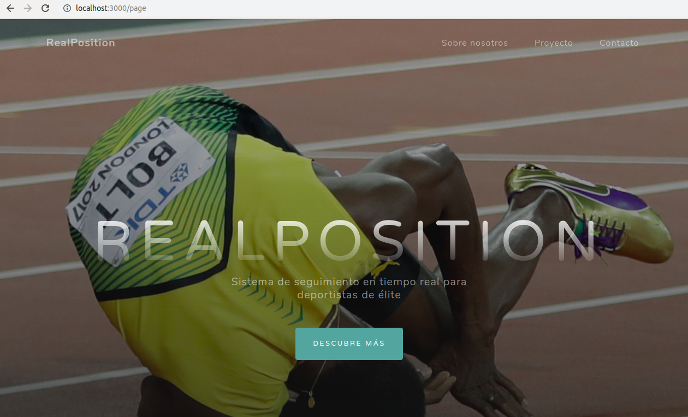

# Hito 5º

En este hito se ha desarrollado la orquestación de nuestro sistema así como la ampliación haciendo un portal web.

## Ampliación

Esta a consistido en desarrollar una página web basada en boostrap a modo de portal para nuestra aplicación que nos sirva para publicitarnos. El servir esta página se ha hecho añadiendo una ruta más a Express.

Basta con añadir el paquete path y el siguiente código:

```
app.use('/page', express.static('page'));

app.get("/page",function(req,res){
  res.sendFile(path.join(__dirname + '/page/index.html'));
});

```

Con esto le estamos diciendo que nos muestre nuestro index.html cuando se haga un get a la ruta page y que nos sirva tambien los archivos estáticos que hay en la ruta page. Si hacemos una llamada a la ruta page este es el resultado.



## Vagrant
