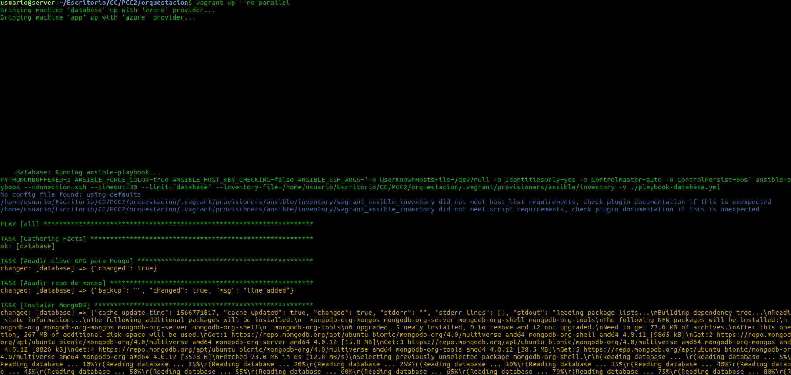
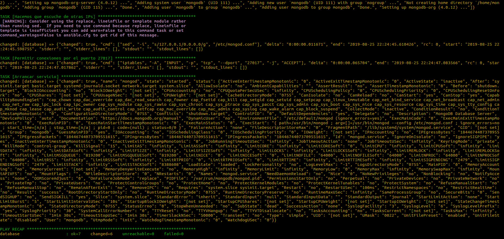
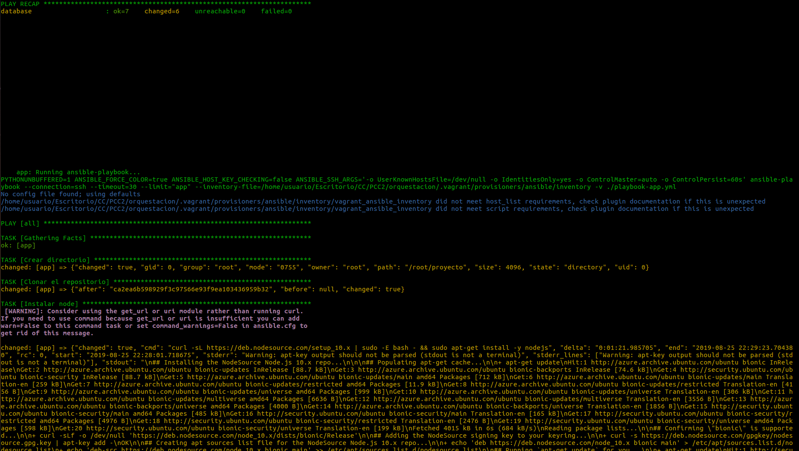
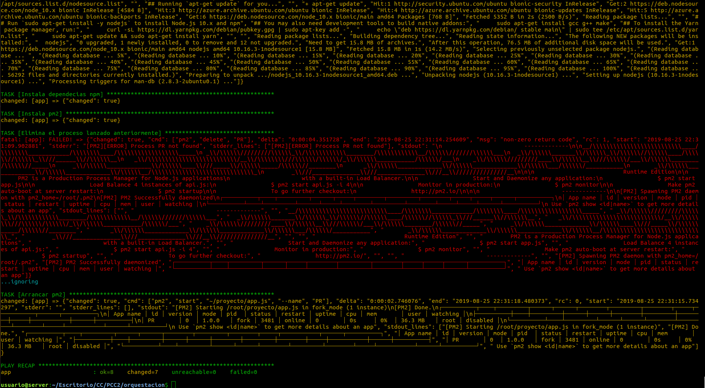
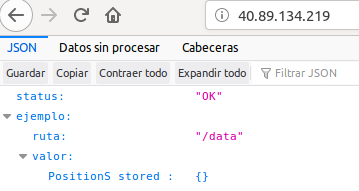

# Hito 5º

En este hito se ha desarrollado la orquestación de nuestro sistema así como la ampliación haciendo un portal web.

## Ampliación

Esta a consistido en desarrollar una página web basada en boostrap a modo de portal para nuestra aplicación que nos sirva para publicitarnos. El servir esta página se ha hecho añadiendo una ruta más a Express.

Basta con añadir el paquete path y el siguiente código:

```
app.use('/page', express.static('page'));

app.get("/page",function(req,res){
  res.sendFile(path.join(__dirname + '/page/index.html'));
});

```

Con esto le estamos diciendo que nos muestre nuestro index.html cuando se haga un get a la ruta page y que nos sirva tambien los archivos estáticos que hay en la ruta page. Si hacemos una llamada a la ruta page este es el resultado.


## Vagrant

La orquestación se ha realizado con con vagrant, ya que es la herramienta que más uso tiene en este apartado.

Para comenzar debemos de instalarla, seguidamente debemos de preparar la herramienta para su uso con Azure. Para ello, se ha seguido [el getting started del reposotorio oficial de azure en github.](https://github.com/Azure/vagrant-azure)

Primero hacemos el login con azure, yo ya lo tengo hecho del hito anterior. Elegimos la nueva suscripción y ejecutamos el siguiente comando para crear un directorio de aplicacion activo de azure con acceso al gestor de recursos:

```
az ad sp create-for-rbac

```

Estos valores devueltos nos van a hacer falta para nuestro Vagrantfile.

### Eleccion de imagen y recursos

La elección tomada es la misma que la del hito anterior y las razones se exponen en [el hito anterior](./hito4.md).


### Provisionamiento

A continuación se muestra el archivo del Vagranfile.

Antes de su ejecución, se deben de declarar las variables de AZURE_TENTANT_ID, AZURE_CLIENT_ID, AZURE_CLIENT_SECRET, AZURE_SUBSCRIPTION_ID como varibles de entorno y darle el valor que nos ha salido antes con la orden *az ad sp create-for-rbac*.

Para la ID de la subscripción, debemos de ejecutar el siguiente comando:

```
az account list --query "[?isDefault].id" -o tsv
```

El archivo de Vagranfile, se puede encontrar en [este enlace](./../orquestacion/Vagrantfile), comienza creando un box de azure y acaba con la provisión de dos máquinas virtuales:

```


Vagrant.configure('2') do |config|


  config.vm.define "database" do |database|
    database.vm.box = 'azure'
    database.ssh.private_key_path = '~/.ssh/id_rsa' #copiamos clave ssh
    database.vm.provider :azure do |azure, override|

      # VARIABLES OBLIGATORIAS
      azure.tenant_id = ENV['AZURE_TENANT_ID']
      azure.client_id = ENV['AZURE_CLIENT_ID']
      azure.client_secret = ENV['AZURE_CLIENT_SECRET']
      azure.subscription_id = ENV['AZURE_SUBSCRIPTION_ID']

      # OPCIONALES
      azure.vm_name="hito5-database"
      azure.admin_username="antonio"
      azure.vm_image_urn="Canonical:UbuntuServer:18.04-LTS:latest"
      azure.location="francecentral"
      azure.resource_group_name="CC-Hito5"
      azure.vm_size = 'Standard_A0'
      azure.virtual_network_name="redprivada" #red virtual
      azure.tcp_endpoints = 27017 #abrimos solo puerto 27017


    end
    #provisionamos
    database.vm.provision "ansible" do |ansible|
      ansible.compatibility_mode = "2.0"
      ansible.verbose = "v"
      ansible.playbook = "./playbook-database.yml"
    end
  end

  config.vm.define "app" do |app|
    app.vm.box = 'azure'
    app.ssh.private_key_path = '~/.ssh/id_rsa'
    app.vm.provider :azure do |azure, override|

      # VARIABLES OBLIGATORIAS
      azure.tenant_id = ENV['AZURE_TENANT_ID']
      azure.client_id = ENV['AZURE_CLIENT_ID']
      azure.client_secret = ENV['AZURE_CLIENT_SECRET']
      azure.subscription_id = ENV['AZURE_SUBSCRIPTION_ID']

      # OPCIONALES
      azure.vm_name="hito5-app"
      azure.admin_username="antonio"
      azure.vm_image_urn="Canonical:UbuntuServer:18.04-LTS:latest"
      azure.location="francecentral"
      azure.resource_group_name="CC-Hito5"
      azure.vm_size = 'Standard_A0'
      azure.virtual_network_name="redprivada" #usamos el mismo nombre de la red
      azure.tcp_endpoints = [80,27017] #abrimos puertos 80 y 27017

    end
    #provisionamos
    app.vm.provision "ansible" do |ansible|
      ansible.compatibility_mode = "2.0"
      ansible.verbose = "v"
      ansible.playbook = "./playbook-app.yml"
    end
  end


end
```

Para realizar este archivo se ha partido de la base que se encuentra en el getting started de azure para vagrant anteriormente comentado. Se han terminado por crear dos máquinas vituales y se han provisionado.

Primeramente se exporta la clave ssh para poder acceder, luego se les da valor a las variables obligatorias previamente comentadas, y por último las opcionales, que tienen que ver con los parametros de la máquina virtual.

Existen muchos parametros a configurar, pero solo me he centrado en los que en hitos anteriores he usado, como la localización, el grupo de seguridad de red, la apertura de puertos, la imagen y el usuario. La justificacion de la eleccion de la imagen y del grupo de recursos ya se han expuesto en hitos anteriores.

Se crean dos máquinas, una de ellas tiene la base de datos a la que accede nuestra aplicación y la otra la aplicacion propiamente dicha a la cual accedemos. Para provisionarlas se han creado dos archivos de provisionamiento diferentes. Es importante el orden de creación. Primero la base de datos y luego la aplicación. Ya que de esta forma cuando la aplicación se inicia tiene la base de datos ya creada, si lo accedmos al reves la conexion de la aplicacion a la base de datos fallará.

Destacar, que en la maquina virtual de la base de datos solo se ha puesto el puerto 27017 correspondiente a mongo. En la máquina virtual de la aplicación se abren el puerto 80 y 27017. Esta apertura de puertos es lo lógico, ya que la de base de datos solo se quiere utilizar para ese proposito y la de aplicación se utiliza para hacer peticiones http y debe de realizar consultas a la base de datos contenida en la otra máquina. Por último, se crea una red con el mismo nombre en las dos, esto hace que las dos máquinas esten en la misma subred y puedan acceder entre ellas, azure por defecto asigna a la primera maquina la IP 10.0.0.4 y a la segunda la IP 10.0.0.5. Esto se indica en la aplicación para decirle la ruta de conexión de la base de datos.

### Cambios en los archivos de provision

Principalmente, el cambio más sustancial es dividir el playbook original en dos. En el [playbook de la aplicación](./../orquestacion/playbook-app.yml) quitamos todo lo referente a la base de datos y lo metemos en el [playbook de la base de datos](./../orquestacion/playbook-database.yml).

El playbook de la app lo dejamos igual, pero añadimos reglas de entrada a los puertos 80 y 22 (no deberia de hacer falta pero de esta manera me ha funcionado), ahora tenemos que añadir en el playbook de la base de datos la configuracion de mongo para que se pueda acceder remotamente. Para ello solo tenemos que usar el siguiente comando antes de ejecutar la app:

```
sed -i 's/127.0.0.1/0.0.0.0/g' /etc/mongod.conf
```

Esto lo que hace es usar el comando sed, que busca cadenas que coincidan con expresiones regulares que se les pase y la sustituye por otra expresion en el fichero de configuracion de mongo. Se sustituye por 0.0.0.0 para que escuche de todas las IPs que le lleguen. Por último, se abre el puerto correspondiente a mongo,(no deberia de ser necesario ya que eso se indica en el Vagrantfile, pero no me funcionaba si no lo hacia). Me he servido de [esta web](https://www.mkyong.com/mongodb/mongodb-allow-remote-access/) para justificar estos cambios.


Para lanzar el archivo de vagrantfile solo basta con ejecutar el siguiente comando usando este flag como se indica en [este issue](https://github.com/Azure/vagrant-azure/issues/213):


```
vagrant up --no-parallel

```

Con esto realizamos tanto la creación de la máquina virtual como de su provisionamiento. Podemos acceder a la maquina vitual con:

```
vagrant ssh app
```

para la máquina de la aplicacion, o

```
vagrant ssh database

```

para la máquina de la base de datos.

El provisiomaniento tambien se puede hacer con:

```
vagrant provision app
```
para provisionar la máquina donde corre la aplicación o con

```
vagrant provision database
```

para provisionar la aplicación donde corre la base de datos.


Esta es la salida de hacer el vagrant up:






No entiendo porque no me aparecia la salida de vagrant en la terminal y si la del provisionamiento, supongo que será la version del vagrant.

Por último, hacemos una peticion a la IP.


