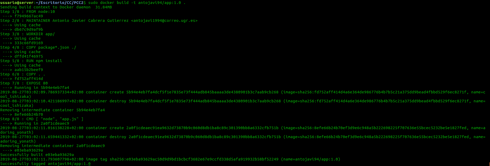
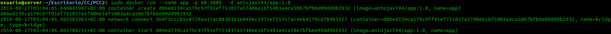
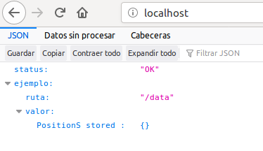
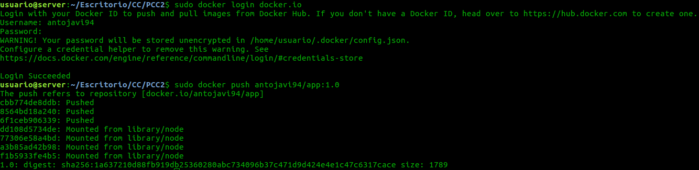
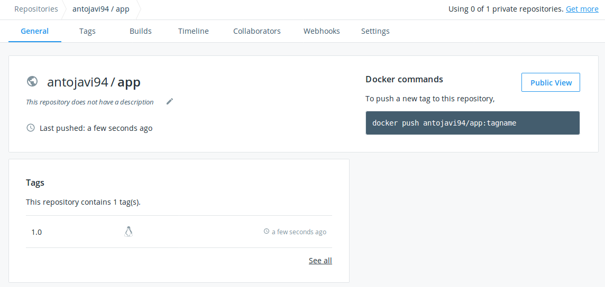

# Hito 6

En este hito se ha desarrollado un despliegue de nuestra aplicación en contendores. Se ha utilizado Docker.

En este hito se ha desarrollado un despliegue en local y otro en la nube.

Como nuetra aplicación consta de dos servicios independientes, se ha desplegado dos contendores. Uno para la API REST y otro para la base de datos.

La base de datos al ser una simple instancia de mongodb podemos bajarnosla de DockerHub directamente. La de nuestro servicio debemos de crearla.

## Dockerfile


A continuacion se va a explicar el Dockerfile.

Se ha intentado usar una imagen ligera, como se ha visto en los apuntes de clase la version Alpine es muy ligera, por lo que se ha optado por usar esta imagen, node:10-alpine. Al intentar crear la imagen he tenido varios problemas de dependencias y no se ha conseguido crear la imagen de forma satisfactoria.

Por lo que al final se ha optado por usar la imagen por defecto para una aplicación escrita en NodeJS, node:10.

Este es el archivo Dockerfile:

```
FROM node:10

MAINTAINER Antonio Javier Cabrera Gutierrez <antojavi1994@correo.ugr.es>

WORKDIR app/

COPY package.json ./

RUN npm install


COPY . .

EXPOSE 80
EXPOSE 27017

CMD [ "node", "app.js" ]


```
Para el desarrollo de este Dockerfile se ha seguido la [guia oficial de nodejs](https://nodejs.org/de/docs/guides/nodejs-docker-webapp/) para desplegar una aplicación de este tipo en un contendor Docker. Ahora vamos a explicar detelladamente el fichero Dockerfile

* FROM: Indicamos la imagen desde la que queremos construir nuestra imagen, en este caso es una imagen que contiene la versión 10 de node.
* MAINTAINER: Se indica el desarrollador de la imagen.
* WORKDIR: Se crea el directorio donde estará el código de la aplicación.
* COPY: Se copia las dependencias en el direcotio de ejecucion.
* RUN: Se ejecuta el comando npm install para ejecutar las dependencias. Esta imagen no necesita instalar npm.
* COPY: Copia el resto del código de la aplicación dentro de la imágen Docker, (en este caso copiamos todo el proyecto).
* EXPOSE: "Abre" el puerto 80 y el 27017 para posteriormente realizar un binding de estos puertos al puerto que le indiquemos.
* CMD: Establece el comportamiento por defecto del contenedor, en este caso ejecuta nuestra aplicación.

Para generar la imagen ejecutamos el siguiente comando:

```
sudo docker build -t antojavi94/app:1.0 .

```
Esta es la salida:



COn el nombre de usuario/imagen:version nos servirá para subirlo luego a DockerHub.

Ahora que tenemos nuestra aplicación en una imagen debemos de crear una de mongodb, para ello se ha usado [la oficial](https://hub.docker.com/_/mongo).

Para ello debemos de ejeucar el siguiente comando:

```
sudo docker pull mongo

```
Esto nos la baja y ahora la desplegamos con el siguiente comando:

```
sudo docker run --name database -d -p 27017:27017 mongo --noauth --bind_ip=0.0.0.0
```
Con este comando le indicamos que ligue el puerto 27017 de nuestra máquina al suyo propio y que escuche de todas las IPs.

Ahora debemos de echar a andar nuestra imagen creada con el siguiente comando:

```
sudo docker run --name app -p 80:3000 -d antojavi94/app:1.0

```

Esta es la salida:



Ahora si accedemos al localhost podemos ver que nuestra aplicación esta funcionando:




## DockerHub

Ahora vamos a subir nuestra imagen a DockerHub. Para ello nos debemos de registrar y una vez hecho esto poner el siguiente comando para registrarnos en local:

```
sudo docker login docker.io

```

Ahora podmeos subir nuestra imagen con el siguiente comando:

```
sudo docker push antojavi94/app:1.0

```
Esta es la salida:



Si accedemos a nuestro DockerHub podemos ver que esta la imagen subida:



## Despliegue en Azure
